# Keylogger (Educational Tool) 

# ⚠️ **ETHICAL USE DISCLAIMER** ⚠️

> ## 🛑 **WARNING: LEGAL AND ETHICAL RESTRICTIONS APPLY** 🛑
> 
> **`THIS SOFTWARE IS INTENDED SOLELY FOR EDUCATIONAL PURPOSES AND ETHICAL USE.`**  
> **`UNAUTHORIZED MONITORING OF INDIVIDUALS WITHOUT THEIR EXPLICIT CONSENT IS ILLEGAL IN MOST JURISDICTIONS.`**
>
> ### 🔒 By using this software, you affirm that:
> - You will ONLY use it on devices you own or have explicit written permission to monitor
> - You will NEVER deploy it for malicious or unauthorized purposes
> - You accept FULL legal responsibility for any misuse
> - You understand that violating privacy laws may result in criminal prosecution
>
> ### 🚫 STRICTLY PROHIBITED:
> - ❌ Non-consensual monitoring of others  
> - ❌ Capturing sensitive personal information  
> - ❌ Deployment on public or shared systems  
> - ❌ Any illegal surveillance activities  
>
> **The developer disclaims ALL responsibility for unethical or illegal use of this software. Use at your own risk and with proper legal counsel.**

# 🔐 Educational Keylogger with Encryption

> **Disclaimer**: This tool demonstrates security concepts for **educational purposes only**. Unauthorized use is strictly prohibited.

## 🌟 Overview
A basic keylogger application with a graphical interface designed to demonstrate:
- How keyloggers capture user input
- Encryption techniques for sensitive data
- Responsible disclosure of security concepts

  
*Example interface - actual appearance may vary*

---

## 🚀 Features
### Activity Monitoring
- **⌨️ Real-time keyboard tracking** (key presses/releases)
- **🖱️ Mouse movement logging** (coordinates and actions)
- **🖱️ Mouse click detection** (left/right/middle buttons)

### Security Implementation
- **🔑 AES-128 encryption** via Fernet
- **📁 Encrypted log storage** (`keylog_encrypted.log`)
- **🔐 Automatic key management** (`key.key` generation)
- **⚠️ Multiple disclaimer warnings**

### User Interface
- **▶️ Start/Stop** monitoring controls
- **🔍 Encrypted log viewing**
- **🔓 Decrypted log viewing** (requires key)
- **📜 Real-time activity display**

---

## ⚙️ Installation
### Requirements
- Python 3.7+
- Required packages:
  ```bash
  pip install tkinter pynput cryptography

## 🛠️ Usage
1. **Launch the application**:
   ```bash
   python keylogger_gui.py
Acknowledge the ethical disclaimer
(Mandatory pop-up appears on startup)

## 🎛️ Interface Controls

| Button               | Functionality                             | Keyboard Shortcut |
|----------------------|-------------------------------------------|------------------|
| <kbd>▶️ Start Keylogger</kbd> | Begin monitoring keyboard/mouse activity  | - |
| <kbd>⏹️ Stop Keylogger</kbd>  | Pause monitoring                          | <kbd>ESC</kbd> |
| <kbd>🔍 View Encrypted Log</kbd> | Display encrypted log data              | - |
| <kbd>🔓 View Decrypted Log</kbd> | Show decrypted content (requires key.key) | - |

### Key Features:
- **Real-time Feedback**: Activity appears immediately in the display window
- **One-click Control**: Simple start/stop operation
- **Visual Indicators**: 
  - ▶️ Green = Monitoring active
  - ⏹️ Red = Monitoring paused
- **Secure Viewing**: 
  - 🔍 Encrypted view shows ciphertext 
  - 🔓 Decrypted view requires valid `key.key`

### Usage Flow:

Access log files:

Encrypted logs: keylog_encrypted.log

Encryption key: key.key (Store in secure location!)

## ⚖️ Ethical Guidelines
✅ Permitted Uses
Personal educational experiments

Security awareness training

Academic research (with institutional approval)

Testing only on your own devices

## 🚫 Strict Prohibitions
Non-consensual monitoring of others

Capturing sensitive information:

🔑 Passwords and credentials

💳 Financial data (credit cards, bank details)

🆔 Personal identification (SSN, IDs)

Deployment on:

Public computers (libraries, cafes)

Shared systems (family computers, workstations)

Organization networks without explicit authorization

## 🔒 Security Notes

| Risk                          | Mitigation Strategy                      | Severity |
|-------------------------------|------------------------------------------|----------|
| **Key compromise**            | Store `key.key` offline in encrypted storage | ⚠️ High   |
| **Log file exposure**         | Automatically purge logs after sessions  | ⚠️ High   |
| **Antivirus detection**       | Add exclusion during testing period      | � Medium  |
| **Legal liability**           | Obtain written consent before use        | ⚠️ High   |
| **Accidental data collection**| Avoid typing sensitive info during tests | ⚠️ High   |

### Additional Security Best Practices:
1. **Physical Security**  
   - Restrict physical access to devices running the keylogger
   - Use full-disk encryption on test machines

2. **Network Isolation**  
   - Disable internet access during testing sessions
   - Use air-gapped systems when possible

3. **Key Management**  
   ```mermaid
   graph LR
   A[Generate Key] --> B[Store Encrypted]
   B --> C[Use Only During Decryption]
   C --> D[Immediate Deletion]
## ⚙️ Technical Specifications

### 🔐 Encryption Implementation
| Aspect             | Implementation       | Details                                                                 |
|--------------------|----------------------|-------------------------------------------------------------------------|
| **Algorithm**      | AES-128             | FIPS 197 certified symmetric encryption                                 |
| **Mode**           | Fernet (CBC mode)   | Cipher Block Chaining with PKCS7 padding                                |
| **Key Size**       | 128-bit             | Equivalent to 3.4×10³⁸ possible keys                                    |
| **Key Derivation** | PBKDF2HMAC          | 100,000 iterations with SHA-256 hashing                                 |
| **Key Management** | Local `key.key` file | Base64-encoded 32-byte key                                              |
| **Security**       | 128-bit security    | NIST recommended until 2030+ for non-classified data                    |

### Encryption Process Flow

## 🔍 Event Tracking Details

### ⌨️ Keyboard Monitoring
| Metric         | Details                  | Sample Output                    |
|----------------|--------------------------|----------------------------------|
| **Key Press**  | Records key depression   | `Key pressed: 'a'`               |
| **Key Release**| Records key release      | `Key released: Key.esc`          |
| **Special Keys**| Handles modifier keys    | `Key pressed: Key.ctrl`          |
| **Key Combos** | Tracks simultaneous keys | `[Ctrl] + [C] pressed`           |

### 🖱️ Mouse Monitoring
| Metric             | Details                          | Sample Output                                 |
|--------------------|----------------------------------|-----------------------------------------------|
| **Movement**       | X/Y coordinates                  | `Mouse moved to (542, 317)`                   |
| **Button State**   | Pressed/Released status          | `Mouse pressed at (120, 85) with Button.left` |
| **Click Type**     | Distinguishes button types       | `Mouse released with Button.right`            |
| **Scroll Events**  | Wheel movements (if implemented) | `Mouse scrolled: (0, 5)`                      |


## 📦 Dependencies

| Package         | Version     | Purpose                          | Installation Command          |
|-----------------|-------------|----------------------------------|-------------------------------|
| **`tkinter`**   | Built-in    | Graphical user interface (GUI)   | Included with Python          |
| **`pynput`**    | ≥1.7.6      | Keyboard/mouse input monitoring  | `pip install pynput`          |
| **`cryptography`** | ≥38.0.4    | Data encryption/decryption       | `pip install cryptography`    |


## ⚠️ Limitations

| Limitation                          | Impact                                  | Workaround                     |
|-------------------------------------|-----------------------------------------|--------------------------------|
| **Visible UI Window**              | No stealth capabilities                 | Not intended for covert use    |
| **Basic Interface**                | Limited filtering/sorting options       | Manual log analysis            |
| **Antivirus Triggers**             | False positives expected                | Add exclusion during testing   |
| **Keyboard Layouts**               | QWERTY only (non-adaptive)              | Manual key mapping adjustments |
| **Log Management**                 | No auto-rotation/compression            | Manual log cleanup             |
| **Mouse Performance**              | Coordinate logging may slow old systems | Reduce polling frequency       |
| **Network Capabilities**           | Local storage only                      | Manual file transfer           |

> **System Impact Note**: Performance varies based on hardware configuration and usage intensity

---

## 📜 Legal Notice

### 🔐 Global Compliance Requirements

```mermaid
graph LR
    A[Your Jurisdiction] --> B(GDPR)
    A --> C(CCPA)
    A --> D(CFAA)
    A --> E(Local Laws)
    B --> F[€20M or 4% global revenue]
    C --> G[$7500 per violation]
    D --> H[10+ years imprisonment]
```

## ❓ Support
- This is unsupported educational software.
- For academic inquiries:

Open an issue in this repository

Prefix title with "[Academic]"

Include:

- Educational context

- Research objectives

- Institutional affiliation

## ⚠️ FINAL WARNING: Use responsibly and legally.
Violations may result in severe legal consequences.
